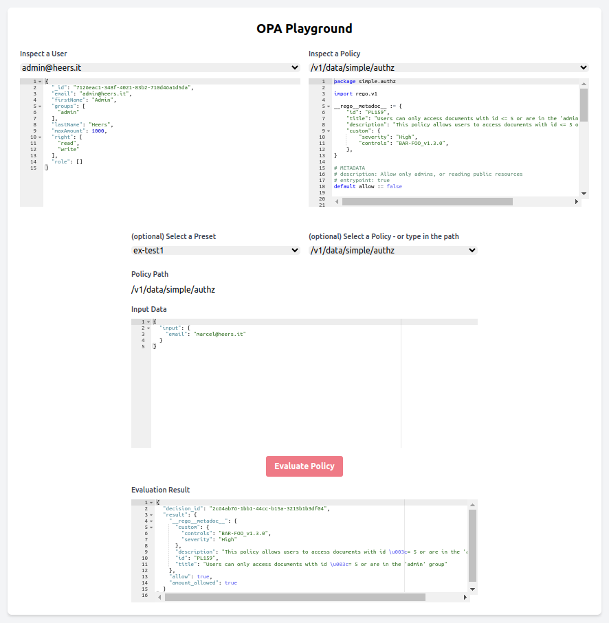

# OPA Live Playground



## Usage

```bash
export OPA_URL="http://localhost:8181"
export PRESETS_PATH="../../../private-github/opa/tests"
go run github.com/maddalax/htmgo/cli/htmgo@latest watch
```

# Build

```bash
cd ci/

export $(cat .env | xargs)
dagger call build-and-push-image --src ../ --registry-token=env:REGISTRY_ACCESS_TOKEN
```


## TODO

- [ ] live reload when user dropdown changed
- [ ] live reload when policy dropdown changed
- [x] sort users
- [x] sort policies
- [ ] search users
- [ ] search policies
- [ ] allow to write policy
- [ ] select OPA url in UI
- [x] integrate ace editor with rego syntax highlight and JSON folding
- [x] add presets
- [ ] search presets
- [x] restructure layout
- [ ] link docs and opa server
- [ ] add terminal in ui
- [ ] show expected result and compare with actual result when a preset is used
- [ ] copy as curl
- [ ] sharable url
